 

Founder & CEO, Phielia

Building real-time intelligence for enterprise conversations.

LinkedIn · GitHub

⸻

About

I’m Luke, a self-taught founder and engineer building Phielia.

Phielia is a real-time coaching layer for live enterprise conversations. It helps sales teams understand what is happening in a conversation and act on that context while the conversation is still happening.

I build the product myself, from the interface and infrastructure to the data and AI systems behind it.

Before Phielia, I built and experimented with several products. Those attempts taught me how to ship quickly, work through uncertainty, and keep iterating when things do not work the first time.

Now I’m focused on one thing: building Phielia into something people cannot imagine working without.

⸻

Building

Phielia

Real-time intelligence for enterprise conversations.

Live conversations generate enormous amounts of information that is difficult to capture, understand, and act on in the moment.

Phielia is being built to close that gap.

Focus

Real-time AI · Conversation Intelligence · Enterprise Software · Applied AI

⸻

Principles

Build the real thing.
I learn by shipping systems and putting them in front of users.

Own the stack.
Understanding the underlying systems makes it possible to move quickly without waiting on someone else.

Start with the problem.
Technology is useful when it removes a real constraint.

Iterate relentlessly.
Every build is an opportunity to learn something the previous one could not teach.

⸻

Technologies

⸻

Luke Cline · Founder & CEO, Phielia

Building.

